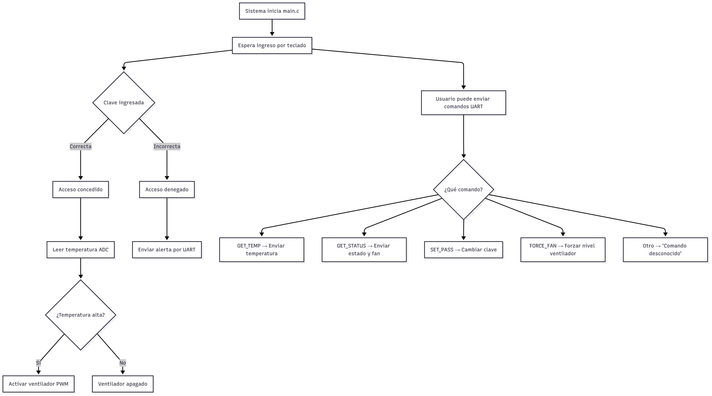

# Control de Acceso Inteligente para Habitación

## Integrantes
- Luis Fernando Castro 
- William Camilo Obando

---

## Descripción del Proyecto

Este proyecto implementa un sistema embebido para el control de acceso y ventilación de una habitación utilizando un microcontrolador STM32. El sistema gestiona el acceso mediante un teclado y una pantalla OLED, validando una contraseña y controlando un ventilador con PWM basado en temperatura. Además, ofrece un modo de emergencia y control automático del ventilador

---

## Funcionalidades Implementadas

- Ingreso de contraseña desde un teclado matricial
- Control de acceso (bloqueo/desbloqueo de puerta)
- Visualización en pantalla OLED (clave, mensajes de estado)
- Control automático del ventilador por temperatura
- Control PWM del ventilador con distintos niveles (OFF, LOW, MED, HIGH)
- Cambio automático de estados según temporizadores o entradas
- Retroalimentación visual mediante asteriscos en pantalla al ingresar contraseña

---

## Instrucciones de Compilación y Uso

1. *Entorno Requerido:*
   - STM32CubeIDE o VSCode
   - Bibliotecas de drivers

2. *Conexiones:*
   - Teclado matricial a pines GPIO configurados como entradas/salidas
   - Pantalla OLED vía I2C
   - Ventilador conectado a pin PWM (TIM3_CH1)
   - Sensor de temperatura (Pin ADC_IN5)

3. *Pasos para Ejecutar:*
   - Abre el proyecto en STM32CubeIDE
   - Compila y flashea el código a la placa Nucleo 
   - Verifica conexiones con los pines
   - Interactúa con el sistema desde el teclado
4. *Funcionamineto General*
   

---

## Decisiones de Diseño y Explicaciones de Código
---

### Sistema de control de estados

```c
void room_control_update(room_control_t *room) {
    uint32_t current_time = HAL_GetTick();

    switch (room->current_state) {
        case ROOM_STATE_LOCKED:
            // Mostrar mensaje y asegurar puerta cerrada
            room->door_locked = true;
            // Espera a que se presione una tecla (se maneja en process_key)
            break;

        case ROOM_STATE_INPUT_PASSWORD:
            // Timeout: volver a LOCKED si no hay input en 10s
            if (current_time - room->last_input_time > INPUT_TIMEOUT_MS) {
                room_control_change_state(room, ROOM_STATE_LOCKED);
            }
            break;

        case ROOM_STATE_UNLOCKED:
            // Puerta abierta, LED encendido (puedes agregar aquí si tienes LED)
            room->door_locked = false;
            // Permitir comandos manuales (opcional)
            break;

        case ROOM_STATE_ACCESS_DENIED:
            // Esperar 3 segundos y volver a LOCKED
            if (current_time - room->state_enter_time > ACCESS_DENIED_TIMEOUT_MS) {
                room_control_change_state(room, ROOM_STATE_LOCKED);
            }
            break;

        case ROOM_STATE_EMERGENCY:
            // Lógica de emergencia (opcional)
            break;
    }

    room_control_update_door(room);
    room_control_update_fan(room);

    if (room->display_update_needed) {
        room_control_update_display(room);
        room->display_update_needed = false;
    }
```


| Elemento                        | Función                                   |
| ------------------------------- | ----------------------------------------- |
| HAL_GetTick()                 | Mide el tiempo para gestionar timeouts    |
| switch (room->current_state)  | Ejecuta lógica según estado               |
| room_control_update_door()    | Controla mecanismo físico de la puerta    |
| room_control_update_fan()     | Controla velocidad del ventilador por PWM |
| room_control_update_display() | Actualiza interfaz visual (pantalla OLED) |

### Manejo de entrada de teclado en funcion del estado del sistema. (Interaccion con el dispositivo)
```c
void room_control_process_key(room_control_t *room, char key) {
    room->last_input_time = HAL_GetTick();

    switch (room->current_state) {
        case ROOM_STATE_LOCKED:
            // Iniciar ingreso de contraseña
            room_control_clear_input(room);
            if (room->input_index < PASSWORD_LENGTH && key >= '0' && key <= '9') {
                room->input_buffer[room->input_index++] = key;
                room_control_change_state(room, ROOM_STATE_INPUT_PASSWORD);
            }
            break;

        case ROOM_STATE_INPUT_PASSWORD:
            if (key >= '0' && key <= '9' && room->input_index < PASSWORD_LENGTH) {
                room->input_buffer[room->input_index++] = key;
            }
            // Si ya se ingresaron 4 dígitos, validar
            if (room->input_index == PASSWORD_LENGTH) {
                if (strncmp(room->input_buffer, room->password, PASSWORD_LENGTH) == 0) {
                    room_control_change_state(room, ROOM_STATE_UNLOCKED);
                } else {
                    room_control_change_state(room, ROOM_STATE_ACCESS_DENIED);
                }
            }
            break;

        case ROOM_STATE_UNLOCKED:
            // Permitir volver a LOCKED con '*'
            if (key == '*') {
                room_control_change_state(room, ROOM_STATE_LOCKED);
            }
            break;

        default:
            break;
    }

    room->display_update_needed = true;
}
```

| Estado Actual    | Acción con la tecla        | Resultado                             |
| ---------------- | -------------------------- | ------------------------------------- |
| LOCKED         | Dígito numérico            | Empieza ingreso de clave              |
| INPUT_PASSWORD | Dígito numérico            | Se almacena y evalúa la clave         |
| INPUT_PASSWORD | Clave completa (4 dígitos) | Cambia a UNLOCKED o ACCESS_DENIED |
| UNLOCKED       | Tecla '*'                | Vuelve a LOCKED                     |
| Otro estado      | Cualquier tecla            | Se ignora                             |

### Actualizar la temperatura actual de la habitacion y ajustar el nivel del ventilador

```c
void room_control_set_temperature(room_control_t *room, float temperature) {
    room->current_temperature = temperature;
    
    // Update fan level automatically if not in manual override
    if (!room->manual_fan_override) {
        fan_level_t new_level = room_control_calculate_fan_level(temperature);
        if (new_level != room->current_fan_level) {
            room->current_fan_level = new_level;
            room->display_update_needed = true;
        }
    }
    room->display_update_needed = true;
}
```

| Paso | Acción                                                 | Condición                              | Resultado                                                        |
| ---- | ------------------------------------------------------ | -------------------------------------- | ---------------------------------------------------------------- |
| 1    | Asignar temperatura actual                             | Siempre                                | room->current_temperature = temperature                        |
| 2    | Verificar modo automático                              | !room->manual_fan_override           | Permite ajuste automático del ventilador                         |
| 3    | Calcular nuevo nivel del ventilador                    | Modo automático                        | new_level = room_control_calculate_fan_level(temperature)      |
| 4    | Comparar con nivel actual y actualizar si es diferente | new_level != room->current_fan_level | Cambia el nivel del ventilador y marca actualización de pantalla |
| 5    | Marcar actualización de pantalla                       | Siempre                                | room->display_update_needed = true                             |

### Ingresar Contraseña
```c
        case ROOM_STATE_INPUT_PASSWORD:
            ssd1306_SetCursor(10, 10);
            ssd1306_WriteString("CLAVE:", Font_7x10, White);
            ssd1306_SetCursor(10, 25);
            // Mostrar asteriscos según input_index
            for (uint8_t i = 0; i < room->input_index; i++) {
                ssd1306_WriteString("*", Font_7x10, White);
            }
            break;
```


| Paso | Acción                                   | Función utilizada                    | Resultado                                                       |
| ---- | ---------------------------------------- | ------------------------------------ | --------------------------------------------------------------- |
| 1    | Posicionar cursor para título            | ssd1306_SetCursor(10, 10)          | Cursor se posiciona en la parte superior de la pantalla         |
| 2    | Mostrar texto "CLAVE:"                   | ssd1306_WriteString("CLAVE:", ...) | Instrucción para el usuario de que debe ingresar una contraseña |
| 3    | Posicionar cursor para los asteriscos    | ssd1306_SetCursor(10, 25)          | Cursor baja a una nueva línea para mostrar la entrada           |
| 4    | Mostrar un * por cada dígito ingresado | Bucle con ssd1306_WriteString("*") | Reemplaza cada número ingresado por un asterisco en pantalla    |

### Mostrar la contraseña en nuevo formato ()
```c
        case ROOM_STATE_INPUT_PASSWORD:
            ssd1306_SetCursor(10, 10);
            ssd1306_WriteString("CLAVE:", Font_7x10, White);
            ssd1306_SetCursor(10, 25);
            // Mostrar asteriscos según input_index
            for (uint8_t i = 0; i < room->input_index; i++) {
                ssd1306_WriteString("*", Font_7x10, White);
            }
            break;
```

| Paso | Acción                                   | Función utilizada                    | Resultado                                                       |
| ---- | ---------------------------------------- | ------------------------------------ | --------------------------------------------------------------- |
| 1    | Posicionar cursor para título            | ssd1306_SetCursor(10, 10)          | Cursor se posiciona en la parte superior de la pantalla         |
| 2    | Mostrar texto "CLAVE:"                   | ssd1306_WriteString("CLAVE:", ...) | Instrucción para el usuario de que debe ingresar una contraseña |
| 3    | Posicionar cursor para los asteriscos    | ssd1306_SetCursor(10, 25)          | Cursor baja a una nueva línea para mostrar la entrada           |
| 4    | Mostrar un * por cada dígito ingresado | Bucle con ssd1306_WriteString("*") | Reemplaza cada número ingresado por un asterisco en pantalla    |

### Control automatico con PWM del ventilador en funcion de la temperatura.
```c
static void room_control_update_fan(room_control_t *room) {
    // Control PWM del ventilador según el nivel
    uint32_t pwm_value = 0;
    switch (room->current_fan_level) {
        case FAN_LEVEL_OFF:
            pwm_value = 0;
            break;
        case FAN_LEVEL_LOW:
            pwm_value = (30 * 99) / 100; // 30% de 99
            break;
        case FAN_LEVEL_MED:
            pwm_value = (70 * 99) / 100; // 70% de 99
            break;
        case FAN_LEVEL_HIGH:
            pwm_value = 99; // 100%
            break;
    }
    __HAL_TIM_SET_COMPARE(&htim3, TIM_CHANNEL_1, pwm_value);
}   
```

| Paso | Acción                             | Valor PWM Asignado           | Resultado                                                             |
| ---- | ---------------------------------- | ---------------------------- | --------------------------------------------------------------------- |
| 1    | Inicializar valor PWM              | pwm_value = 0              | Comienza con ventilador apagado                                       |
| 2    | Evaluar current_fan_level        | switch                     | Se selecciona el nivel del ventilador                                 |
| 3    | Asignar PWM según nivel:           |                              |                                                                       |
|      | - FAN_LEVEL_OFF                  | 0                          | Ventilador apagado                                                    |
|      | - FAN_LEVEL_LOW                  | ≈30% ((30*99)/100 = 29)  | Ventilador a baja velocidad                                           |
|      | - FAN_LEVEL_MED                  | ≈70% ((70*99)/100 = 69)  | Ventilador a velocidad media                                          |
|      | - FAN_LEVEL_HIGH                 | 99                         | Ventilador a máxima velocidad                                         |
| 4    | Actualizar señal PWM al ventilador | __HAL_TIM_SET_COMPARE(...) | Se aplica el valor PWM al canal correspondiente del timer (TIM3\_CH1) |

## main.c
### Inicializacion de funciones

ADC1, pin analogico para el sensor, en este caso un sensor analogico LM35
```c
static void MX_ADC1_Init(void);
```

Sistema de control de habitacion:
```c
room_control_init(&room_system);
```
PWM, generar señal
```c
HAL_TIM_PWM_Start(&htim3, TIM_CHANNEL_1);
```

### Leer teclado y actualizar las maquina de estado:
```c
    room_control_update(&room_system);
        // Procesa teclas del keypad
    if (keypad_interrupt_pin != 0) {
      char key = keypad_scan(&keypad, keypad_interrupt_pin);
      if (key != '\0') {
        room_control_process_key(&room_system, key);
      }
      keypad_interrupt_pin = 0;
    }
```

| Línea / Bloque de Código                       | Propósito                                                               |
| ---------------------------------------------- | ----------------------------------------------------------------------- |
| room_control_update(&room_system);           | Ejecuta la lógica de la *máquina de estados* (según tiempo y estado)  |
| if (keypad_interrupt_pin != 0)               | Comprueba si *se presionó una tecla*                                  |
| keypad_scan(...)                             | Identifica *qué tecla fue presionada*                                 |
| if (key != '\0')                             | Verifica que la tecla es válida                                         |
| room_control_process_key(&room_system, key); | Procesa la tecla en el contexto del estado actual (ej. clave, comandos) |
| keypad_interrupt_pin = 0;                    | Limpia el pin de interrupción para permitir nuevas entradas             |

### Leer el sensor a traves de ADC y actualizar logica del sistema
```c
    HAL_ADC_Start(&hadc1);
    if (HAL_ADC_PollForConversion(&hadc1, 10) == HAL_OK) {
      uint32_t adc_value = HAL_ADC_GetValue(&hadc1);
      // Mapea el valor ADC (0-4095) a temperatura (20°C a 40°C)
      float temperature = 20.0f + ((float)adc_value * 20.0f / 4095.0f);
      room_control_set_temperature(&room_system, temperature);
    }
    HAL_ADC_Stop(&hadc1);
```
| Línea de Código                                              | Acción                                                   |
| ------------------------------------------------------------ | -------------------------------------------------------- |
| HAL_ADC_Start(&hadc1);                                     | Inicia una conversión analógica a digital con el ADC1    |
| HAL_ADC_PollForConversion(..., 10)                         | Espera máximo 10 ms a que termine la conversión          |
| HAL_ADC_GetValue(...)                                      | Obtiene el valor digital (0–4095)                        |
| float temperature = 20.0f + ((float)adc_value * 20 / 4095) | Convierte el valor a temperatura entre 20 °C y 40 °C     |
| room_control_set_temperature(&room_system, temperature);   | Actualiza la lógica del sistema con la nueva temperatura |
| HAL_ADC_Stop(&hadc1);                                      | Detiene el ADC para finalizar el proceso                 |
